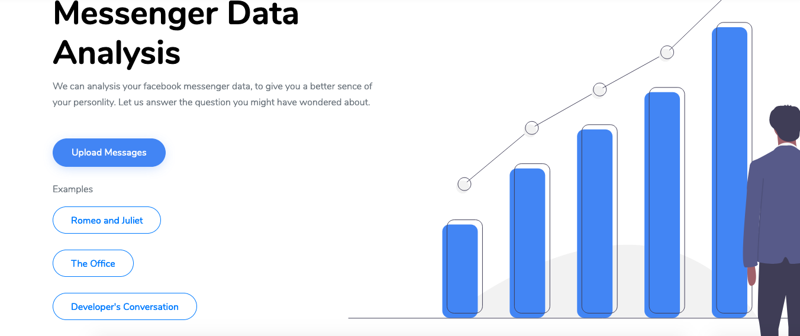
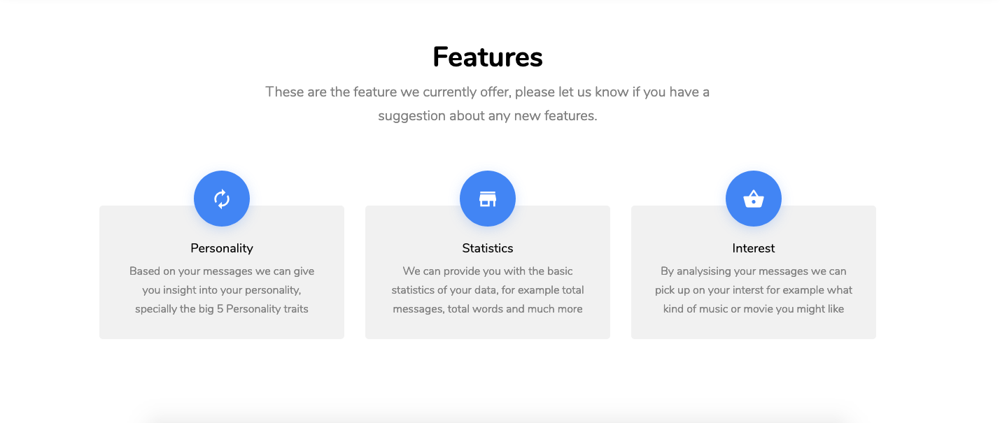
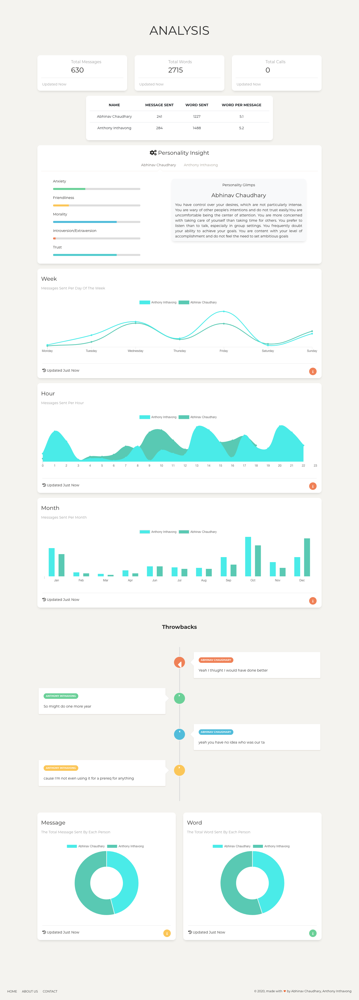
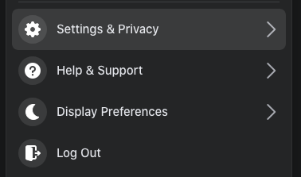
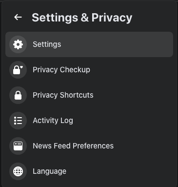
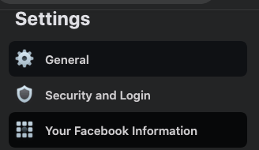
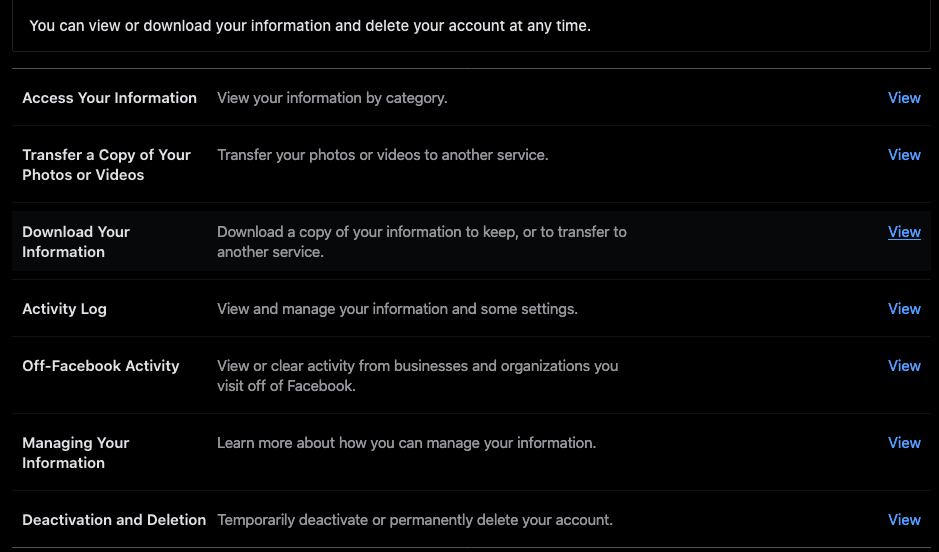
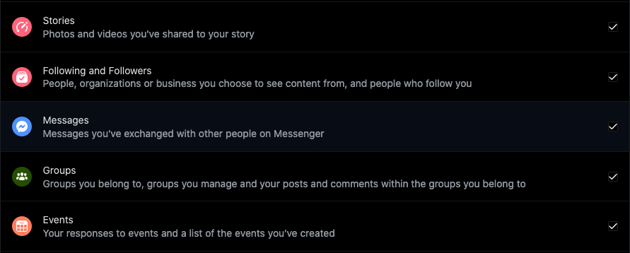
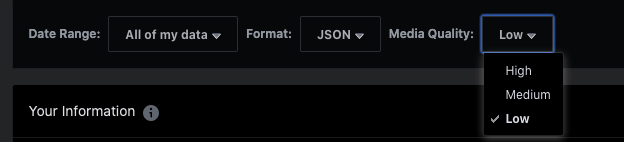

# Mandem !

What started off as a simple weekend turned into a collaborative months long passion [project](http://www.facebook-analysis.ml/) with two friends that just had to much time on their hands.

# What does it show?

Impressive features such as 
* Judging your personality based on your conversation
* Throw backs to old text conversations
* Descriptive statistics and visualizations

# How does it work?

From your Facebook, download you messenger data. It will take a few days, but the results will be interesting. After downloading you will have a collection of threads or conversations as .json. Upload any number of those files into our app and watch the magic happen. We can download our facebook data in 5 easy steps

* 1: Go to Facebook, and click the dropdown on the Top Right. Then to go Settings & Privacy

* 2: Then Click Settings

* 3: Then on the left hand side, click Your Facebook Information

* 4: Download Your information

* You can of course download much more, but what we're looking at is Messages

Just remember to download your information as JSON. Its up to you what media quality is, the higher the more memeory is needed to store on your computer. For our project, we selected the Low for convience.

# Why ?

To learn new skills of course! During the time of this project we learned not only new tools, algorithms, and software (it was quite a bit) but also how to work together. Collaboration is a very important skill that is lacking in practice for academics, so we took it upon ourselves to learn how to work together learn from each other. Not only did we learn to work together but now we have a project that demonstrates as such.

> "Overall it was a good experience to help prepare me for the future" \- Anthony

> "Learned a lot from Anthony about life !" \- Abhinav

The website is currently hosted using Heroku and can be found below. Hope you find this as interesting as we did :)

http://www.facebook-analysis.ml/
